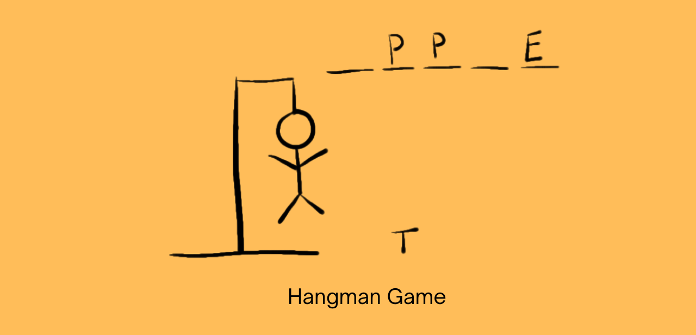

# Hangman Game in Python.

# What is Hangman game?

Hangman game is a word guessing game where players have to guess a missing word by one letter at a time.

### We should know about programming concepts such as:

- random module
- if-else
- for loop
- while loop
- list or list comprehension

Now let’s write a program to create a hangman game in python.
